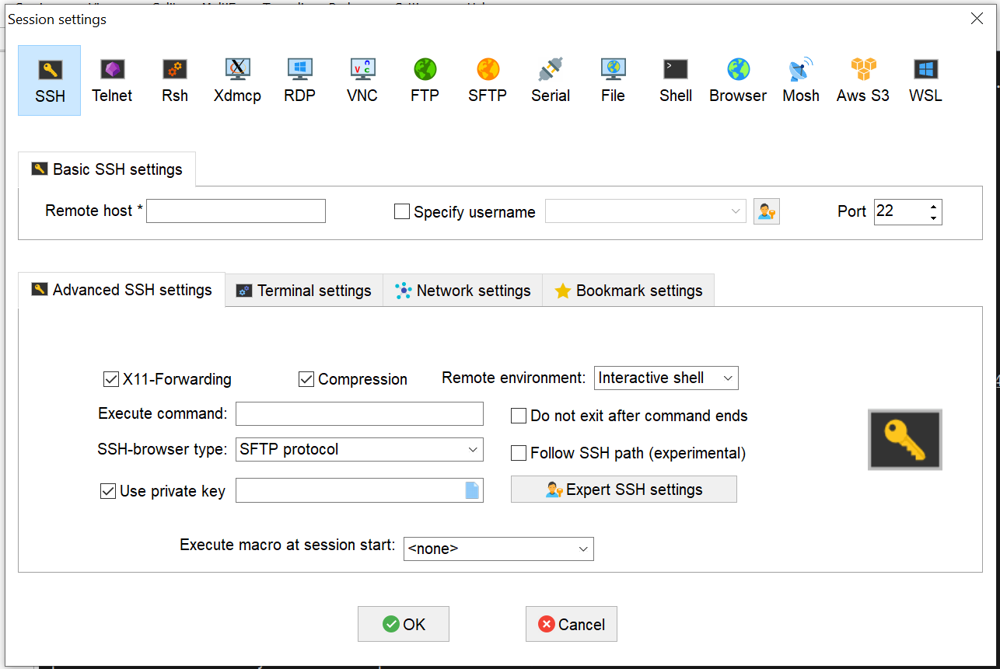
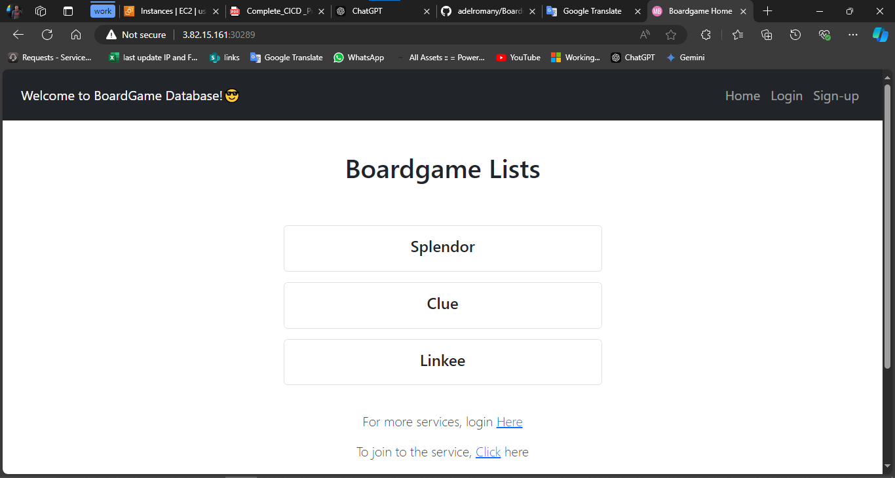
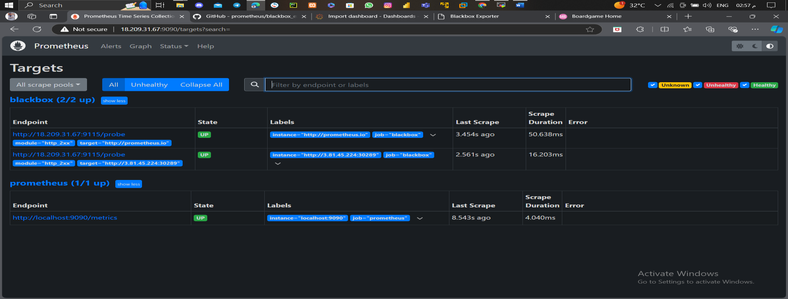

# Infrastructure 
 
Start by creating the infrastructure using Terraform on AWS environment. First we will run the terraform script to create the Kubernetes cluster (Master & 2 Worker Nodes) in addition to the Monitoring instance. 
 
## Terraform 
 
#### Providers     terraform {     required_providers { 
        aws = { 
        source  = "hashicorp/aws" 
        version = "~> 5.0"  # Use the latest version that suits your needs 
        } 
    } 
    } 
 
    provider "aws" { 
        region = "us-east-1" 
         
    } 
 
#### Use the default VPC:     data "aws_vpc" "Default-VPC" {          default = true 
    }  
#### Generate a Key Pair and exporting the DEPI-KeyPair.pem file:     resource "tls_private_key" "DEPI-Key" {           algorithm = "RSA" 
        rsa_bits = 4096 
    } 
 
    # Create the key pair using the public key generated above     resource "aws_key_pair" "DEPI-KeyPair" {          key_name = "DEPI-KeyPair" 
        public_key = tls_private_key.DEPI-Key.public_key_openssh 
    } 
 
    # Create a local file to save the private key     resource "local_file" "KeyPair" {  
        content = tls_private_key.DEPI-Key.private_key_pem         filename = "DEPI-KeyPair.pem" 
    } 
 
    # Output the private key path     output "private_key_path" {          value = local_file.KeyPair.filename     } 
 
#### Configure the Security Group for the instances: 
    resource "aws_security_group" "DEPI-SecurityGroup" {          vpc_id = data.aws_vpc.Default-VPC.id         name = "DEPI-SecurityGroup"         ingress { #To access the VMs via SSH 
            from_port = 22             to_port = 22             protocol = "tcp"             cidr_blocks = ["0.0.0.0/0"] 
        } 
 
        ingress { #For email notifications (will not be used in the project)             from_port = 25             to_port = 25             protocol = "tcp"             cidr_blocks = ["0.0.0.0/0"] 
        } 
 
        ingress { #Range used for most of the applications 
            from_port = 3000             to_port = 10000             protocol = "tcp"             cidr_blocks = ["0.0.0.0/0"] 
        } 
 
        ingress { #HTTP             from_port = 80             to_port = 80             protocol = "tcp"             cidr_blocks = ["0.0.0.0/0"] 
        } 
 
        ingress { #HTTPS             from_port = 443             to_port = 443             protocol = "tcp"             cidr_blocks = ["0.0.0.0/0"] 
        } 
 
        ingress { #Required when setting up Kubernetes cluster 
            from_port = 6443             to_port = 6443             protocol = "tcp"             cidr_blocks = ["0.0.0.0/0"] 
        } 
 
        ingress { #Range used to send mail notification from our Jenkins pipeline to our gmail address             from_port = 465             to_port = 465             protocol = "tcp" 
            cidr_blocks = ["0.0.0.0/0"] 
        } 
 
        ingress { #Range used for deployment of applications             from_port = 30000             to_port = 32767             protocol = "tcp" 
            cidr_blocks = ["0.0.0.0/0"] 
        } 
 
        egress {             from_port = 0             to_port = 0             protocol = "-1" 
            cidr_blocks = ["0.0.0.0/0"] 
        } 
     
    } 
 
#### Kubernetes Cluster 
 
    # Create the EC2 instances     resource "aws_instance" "Master" {         ami           = "ami-0866a3c8686eaeeba"         instance_type = "t2.micro" 
        key_name = aws_key_pair.DEPI-KeyPair.key_name         tags = { 
            Name = "Master" 
        } 
    }  
 
    resource "aws_instance" "Slave-01" {         ami           = "ami-0866a3c8686eaeeba"         instance_type = "t2.micro" 
        key_name = aws_key_pair.DEPI-KeyPair.key_name         tags = { 
            Name = "Slave-01" 
        } 
    }  
 
    resource "aws_instance" "Slave-02" {         ami           = "ami-0866a3c8686eaeeba"         instance_type = "t2.micro" 
        key_name = aws_key_pair.DEPI-KeyPair.key_name 
        tags = { 
            Name = "Slave-02" 
        } 
    }  
 
#### Monitoring Server     resource "aws_instance" "Monitoring" {         ami           = "ami-0866a3c8686eaeeba"         instance_type = "t2.micro" 
        key_name = aws_key_pair.DEPI-KeyPair.key_name         tags = { 
            Name = "Monitoring" 
        } 
    } 
## Terraform apply 
### 1. Use the default VPC

 
 
### 2. Key Pair 

 
 
### 3. Security Group 

 
### 4. EC2 instances created using Terraform 

 
## Setup the Kubernetes Cluster 
 
### 1. Access the instances using MobaXterm application. 
1.	Create a new session.  
2.	Get the public IP address for each instance from AWS. 
3.	
 	  
4.	Copy the public IP address for each instance to the Remote host. 
5.	Check the Specify username box and enter “ubuntu” as the username. 
6.	In the Advanced SSH settings, check the Use private key box and place the .pem file. 
7.	Duplicate the session to create the 2 worker nodes and the Monitoring sessions as well by replacing the Remote host with each IP address. 

 
     
 
### 2. Setup the Master and Worker Nodes 
1.	Run the below command to change to root [On Master & Worker Node] 
 
        • sudo su  
 
2.	Create an executable file and place the following commands then run the script [On Master & Worker Node] 
 
        # Update System Packages  
•	sudo apt-get update 
 
        # Install Docker  
•	sudo apt install docker.io -y 
•	sudo chmod 666 /var/run/docker.sock 
 
        # Install Required Dependencies for Kubernetes  
•	sudo apt-get install -y apt-transport-https ca-certificates curl gnupg 
•	sudo mkdir -p -m 755 /etc/apt/keyrings 
 
        # Add Kubernetes Repository and GPG Key  
•	Curl -fsSL https://pkgs.k8s.io/core:/stable:/v1.28/deb/Release.key | sudo gpg --   dearmor -o 
/etc/apt/keyrings/kubernetes-apt-keyring.gpg 
•	echo 'deb [signed-by=/etc/apt/keyrings/kubernetes-apt-keyring.gpg] 
https://pkgs.k8s.io/core:/stable:/v1.28/deb/ /' | sudo tee /etc/apt/sources.list.d/kubernetes.list 
 
        # Update Package List  
•	sudo apt update 
 
        # Install Kubernetes Components 
•	sudo apt install -y kubeadm=1.28.1-1.1 kubelet=1.28.1-1.1 kubectl=1.28.1-1.1 
 
3.	Run the following commands on the Master node only 
 
        #   Initialize Kubernetes Master Node  
•	sudo kubeadm init--pod-network-cidr=10.244.0.0/16 --ignore-preflight-errors=all 
•	
 
#   After running the above command then our vm will acts as master node and it will generate token to connect this with slave node-copy the token and run the command in slave machines 1 & 2 

 
 
        #   Configure Kubernetes Cluster  
•	mkdir -p $HOME/.kube 
•	sudo cp -i /etc/kubernetes/admin.conf $HOME/.kube/config 
•	sudo chown $(id -u):$(id -g) $HOME/.kube/config 
 
        #   Deploy Networking Solution (Calico)  
•	kubectl apply -f https://docs.projectcalico.org/v3.20/manifests/calico.yaml 
 
        #   Deploy Ingress Controller (NGINX)  
•	kubectl apply -f https://raw.githubusercontent.com/kubernetes/ingress-nginx/controllerv0.49.0/deploy/static/provider/baremetal/deploy.yaml 
 
4.	We'll Scan Kubernetes Cluster For Any Kind Of Issues Using Cube Audit 
 
        # Go To The Website & Copy The Linux_amd_64 Link 
            • 	https://github.com/shopify/kubeaudit/releases 
        # Paste It Using wget Command 
        # Now Untar The File Using tar-xvf File Name 
        # sudo mv kubeaudit /usr/local/bin/->kubeaudit all 

 
 
 
 
 
 
 
 
 
 
 
 
 
 
 
 
 
 
 
 
 
 
 
 
 
 
 

 
# CI / CD Pipeline 
 
Open Jenkins then Start new project  

 
Jenkins Plugin Installation Steps 
1.	Eclipse Temurin Installer o 	Navigate to Jenkins Dashboard -> Manage Jenkins -> Manage Plugins. o 	Go to the Available tab, search for Eclipse Temurin Installer. 
o	Select it and click Install without restart. 
2.	Pipeline Maven Integration o 	Repeat the above steps, searching for Pipeline Maven Integration. 
o	Select and click Install without restart. 
3.	Config File Provider o 	Follow the same procedure, searching for Config File Provider. 
o	Select and click Install without restart. 
4.	SonarQube Scanner o 	Search for SonarQube Scanner in the Available tab. 
o	Select and click Install without restart. 
5.	Kubernetes CLI o 	Search for Kubernetes CLI and select it. 
o	Click Install without restart. 
6.	Kubernetes o 	Find Kubernetes in the Available tab. 
o	Select and click Install without restart. 
7.	Docker o 	Search for Docker and select it. 
o	Click Install without restart. 
8.	Docker Pipeline Step o 	Search for Docker Pipeline Step. 
o	Select and click Install without restart. 
9.	Prometheus metrics o 	Search for Prometheus metrics and select it. 
o	Select and click Install with restart. 
10.	Slack  o 	Finally, search for Slack Notification o 	Select and click Install with restart. 
 
Configure Above Plugins in Jenkins Pipeline 
 
Configure the tools choose manage jenkins → Tools 
1.	Choose jdk and fill as given below 

 
2.	choose sonarqube scanner and configure 

 
3.	choose maven and Configure 

 
 
4.	choose Docker and Configure 

 
 
1. choose Slack and Configure 
a. follow steps from https://plugins.jenkins.io/slack/ Create Credentials 

 configure webhooks in GitHub and SonarQube 

Configure nexus on the pom.xml 
 
 	 <distributionManagement> 
        <repository> 
            <id>maven-releases</id> 
            <url>http://localhost:8081/repository/maven-releases/</url>  
        </repository> 
        <snapshotRepository>  
            <id>maven-snapshots</id> 
            <url>http://localhost:8081/repository/maven-snapshots/</url>  
        </snapshotRepository> 
    </distributionManagement> 

 
The pipeline: pipeline {     agent any 
     
    tools {         jdk 'jdk17'         maven 'maven3' 
    } 
 
    environment { 
        SCANNER_HOME = tool 'sonar-scanner' 
        DOCKER_BUILDKIT = "1" 
    } 
 
    stages { 
        stage('Git Checkout') {             steps {                 git branch: 'main', credentialsId: 'project_git_token', url: 
'https://github.com/MohamedHalim2812/UltimateCICD.git'  //change with your git repository 
            } 
        } 
         
stage('Compile') {     steps { 
        sh "mvn compile" 
    } 
} 
         
        stage('Test') {             steps {                 sh "mvn test" 
            } 
        } 
         
        stage('File System Scan') {             steps { 
                sh "trivy fs --format table -o trivy-fs-report.html ." 
            } 
        } 
         
        stage('SonarQube Analysis') {             steps { 
                withSonarQubeEnv('sonar') { 
                    sh ''' $SCANNER_HOME/bin/sonar-scanner -Dsonar.projectName=BoardGame Dsonar.projectKey=BoardGame \ 
                            -Dsonar.java.binaries=. ''' 
                } 
            } 
        } 
        stage('Quality Gate') {             steps {                 script { 
                    waitForQualityGate abortPipeline: false, credentialsId: 'sonar-token' 
                } 
    } 
} 
 
stage('Build') {     steps { 
                sh "mvn package" 
            } 
        } 
         
        stage('Publish To Nexus') {             steps { 
                withMaven(globalMavenSettingsConfig: 'global-settings', jdk: 'jdk17', maven: 'maven3', mavenSettingsConfig: '', traceability: true) {                     sh "mvn deploy" 
                } 
            } 
        } 
         
        stage('Build & Tag Docker Image') {             steps {                 script { 
                    withDockerRegistry(credentialsId: 'project_docker_token', toolName: 'docker') { 
                        sh "docker build -t mohamedhalim2812/boardgame:latest ."  //change to your docker account 
                    } 
                } 
            } 
        } 
         
        stage('Docker Image Scan') {             steps { 
                sh "trivy image --format table -o trivy-image-report.html mohamedhalim2812/boardgame:latest" //change to your docker account 
    } 
} 
 
stage('Push Docker Image') {     steps { 
                script { 
                    withDockerRegistry(credentialsId: 'project_docker_token', toolName: 'docker') {                         sh "docker push mohamedhalim2812/boardgame:latest" //change to your docker account 
                    } 
                } 
            } 
        } 
         
        stage('Deploy To Kubernetes') { 
            steps {                 withKubeConfig(caCertificate: '', clusterName: 'kubernetes', contextName: '', credentialsId: 'project_k8s_token', namespace: 'ultimate-cicd', restrictKubeConfigAccess: false, serverUrl: 
'https://54.209.235.133') { 
                    sh "kubectl apply -f deployment-service.yaml"   //change with your  credentialsId 
                } 
            } 
        } 
         
        stage('Verify the Deployment') {             steps {                 withKubeConfig(caCertificate: '', clusterName: 'kubernetes', contextName: '', credentialsId: 'project_k8s_token', namespace: 'ultimate-cicd', restrictKubeConfigAccess: false, serverUrl: 
'https://54.209.235.133') { 
                    sh "kubectl get pods -n ultimate-cicd"                     sh "kubectl get svc -n ultimate-cicd" 
                } 
            } 
        } 
}
}

           

 
 
 
 
 
# Monitoring 
##Installing Prometheus 
-	sudo apt update 
-	wget https://github.com/prometheus/prometheus/releases/download/v2.53.2/prometheus-2.53.2.linuxamd64.tar.gz 
-	tar -xvf prometheus-2.53.2.linux-amd64.tar.gz 
-	cd prometheus-2.53.2.linux-amd64/ 
-	./prometheus  &       ## to start Prometheus 
-	18.209.31.67:9090     ## to access prometheus 
 

##Installing Grafana  
-	sudo apt-get install -y adduser libfontconfig1 musl 
-	wget https://dl.grafana.com/enterprise/release/grafana-enterprise_11.2.2_amd64.deb 
-	sudo dpkg -i grafana-enterprise_11.2.2_amd64.deb 
-	sudo  /bin/systemctl start grafana-server          ## to start Grafana  
-	18.209.31.67:3000       ## default username and password : admin 

 
 
## Installing blackbox_exporter 
-	Wget https://github.com/prometheus/blackbox_exporter/releases/download/v0.25.0/blackbox_exporter-
0.25.0.linux-amd64.tar.gz 
-	tar -xvf  blackbox_exporter-0.25.0.linux-amd64.tar.gz 
-	cd blackbox_exporter-0.25.0.linux-amd64/ 
-	./blackbox_exporter  &     ##to start blackbox
-	  18.209.31.67:9115 

 
##Adding Prometheus as a Data Source to Grafana 

 
 
     
## Monitoring the website 
-	Prometheus yaml configuration  
 
 
  
## Restart Prometheus 
-	pgrep prometheus 
-	kill   ##the id - ./prometheus & 
 
 
 
   
  

## Import the dashboard 

 

 

 
 
